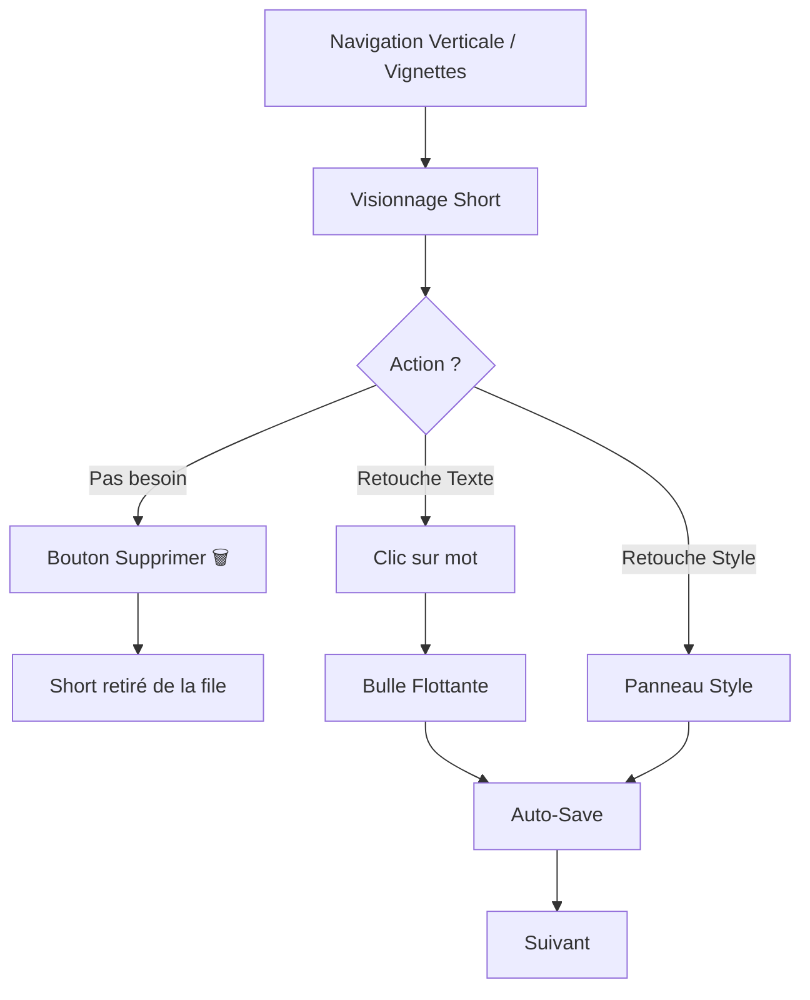
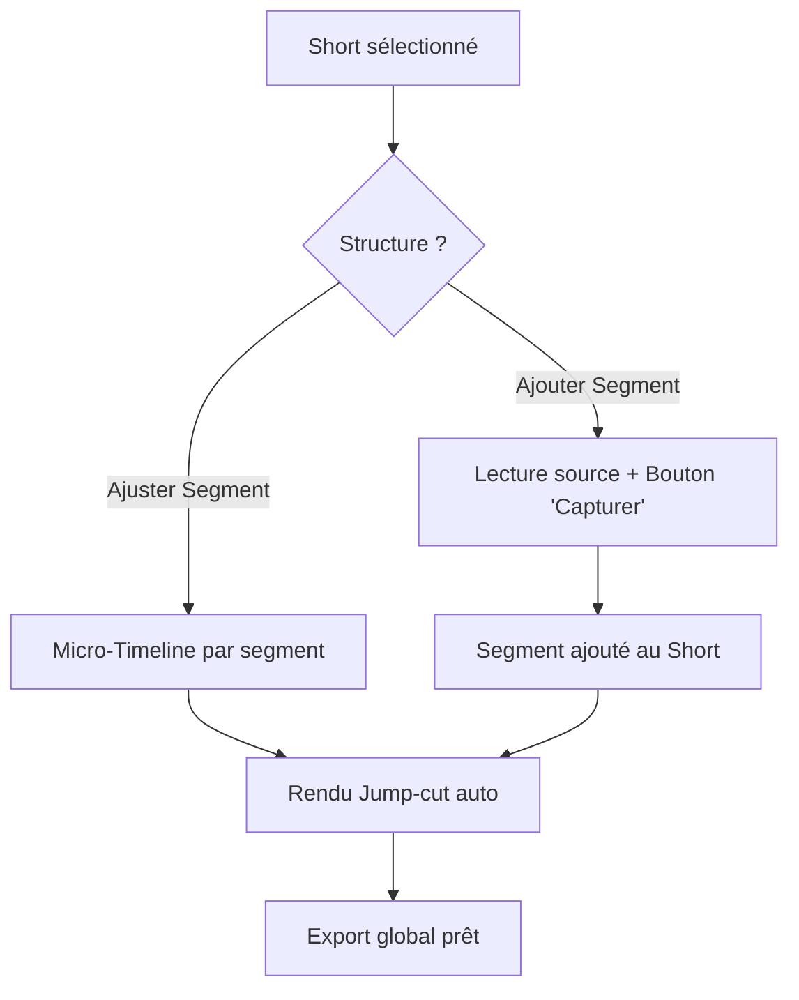

# UX Design Specification youtube-shorter-gemini

**Author:** jef
**Date:** 2026-02-10

---

## Executive Summary

### Project Vision
Permettre à un utilisateur non-technique de transformer une vidéo YouTube longue en plusieurs Shorts verticaux de haute qualité via un processus automatisé "local-first", avec une interface axée sur la simplicité radicale et l'édition textuelle directe. Chaque Short peut être composé d'un ou plusieurs segments non-contigus pour un montage percutant.

### Target Users
Créateurs de contenu et communicants cherchant à maximiser leur présence sur les réseaux sociaux (TikTok, Reels, Shorts) sans la courbe d'apprentissage des logiciels de montage professionnels.

---

## Project Understanding & Discovery

### Core Interaction Model: The Vertical Reel
L'expérience centrale adopte la **Piste A (Vertical Reel)** :
- **Navigation :** L'utilisateur défile verticalement pour passer d'un Short à l'autre.
- **Gestion de Liste :** Par défaut, tous les Shorts proposés sont inclus dans l'export. L'utilisateur n'intervient que pour **Supprimer** un Short dont il ne veut pas.
- **Édition des Sous-titres :** Clic direct sur le texte dans la vidéo.

---

## Core User Experience

### Defining Experience: The Creative Supervisor
L'utilisateur valide le travail de l'IA par "exception" :
- **Navigation par Vignettes :** Pour zapper rapidement.
- **Zéro Timeline Classique :** Remplacée par une gestion de **Segments** au sein d'un même Short via un modèle de "Capture & Ajustement".

---

## Core Interaction Mechanics (V1)

### 2.1 Mechanics: Fine-Tuning the Magic
- **Recadrage Dynamique (Drag-to-Crop) :** Recentrage fluide par glissement.
- **Modèle de Capture :** On capture un segment en cliquant sur un bouton "Garder ce moment" ou via raccourcis clavier. La timeline ne sert qu'à l'ajustement.
- **Édition de Texte Contextuelle (Floating Interaction) :** Bulle d'édition flottante au-dessus du texte.

---

## User Journey Flows

### 2. Parcours "Superviseur" (Revue & Édition Rapide)
L'utilisateur passe en revue les propositions. S'il n'aime pas une proposition, il la supprime. S'il l'aime, il passe à la suivante ou l'affine.

### 3. Parcours "Perfectionniste" (Multi-Segments)
Pour les Shorts nécessitant de combiner plusieurs moments de la vidéo source via le mode "Capture".

---

## Component Strategy

### Custom Components (Lit)

#### 1. Reel Scroller
- **Loop :** Non.
- **Chargement :** Préchargement total par défaut.

#### 2. Short Previewer
Gère le rendu vidéo incluant la concaténation visuelle des segments (jump-cuts) et les sous-titres synchronisés sur l'ensemble.

#### 3. Precision Multi-Timeline (Zoomable)
Affiche le ruban de la vidéo source. Se focalise sur les segments capturés.
- **Refinement Intelligent :** Les poignées de début/fin s'aimantent aux **limites des mots** détectés par la transcription pour éviter les coupures audio abruptes.

---

## UX Consistency Patterns

### 1. Hiérarchie des Actions
- **Action de Suppression (Rouge/Discret) :** Supprimer un Short de la session.
- **Action de Retouche (Contextuelle) :** Apparaît au survol ou clic (Bordures indigo, bulles).
- **Action d'Export (Primaire - Indigo) :** Bouton global "Exporter x Shorts" toujours visible.

### 2. Feedback d'Ajustement
Tout changement (Crop, Texte, Trim) est **sauvegardé instantanément** (Auto-save).

---

## Responsive Design & Accessibility

### 1. Stratégie Responsive (Desktop-first)
L'application est optimisée pour une utilisation sur ordinateur (puissance de calcul locale requise).
- **Layout Studio** : Utilisation de panneaux latéraux persistants pour les vignettes et les styles.
- **Adaptive Sidebars** : Passage en tiroirs (`sl-drawer`) sur les résolutions < 1200px.
- **Tactile** : Non prioritaire.

### 2. Stratégie d'Accessibilité (Pro Keyboard Shortcuts)
Intégration des standards logiciels de montage (Premiere, Resolve) :
- **Lecture** : `Espace` (Play/Pause), `K` (Pause).
- **Navigation Fine** : `J` (Reculer/Ralentir), `L` (Avancer/Accélérer), `Flèches` (Frame by frame).
- **Édition** : `I` (Mark In / Début segment), `O` (Mark Out / Fin segment).
- **Gestion** : `Suppr/Backspace` (Supprimer le Short sélectionné).
- **Inclusion** : Indice de contraste WCAG 2.1 AA pour l'interface et ombres portées obligatoires sur les sous-titres dynamiques.

### 3. Testing Strategy
- Tests automatisés via **Axe-core**.
- Validation manuelle de la fluidité des raccourcis clavier "No-Mouse workflow".
