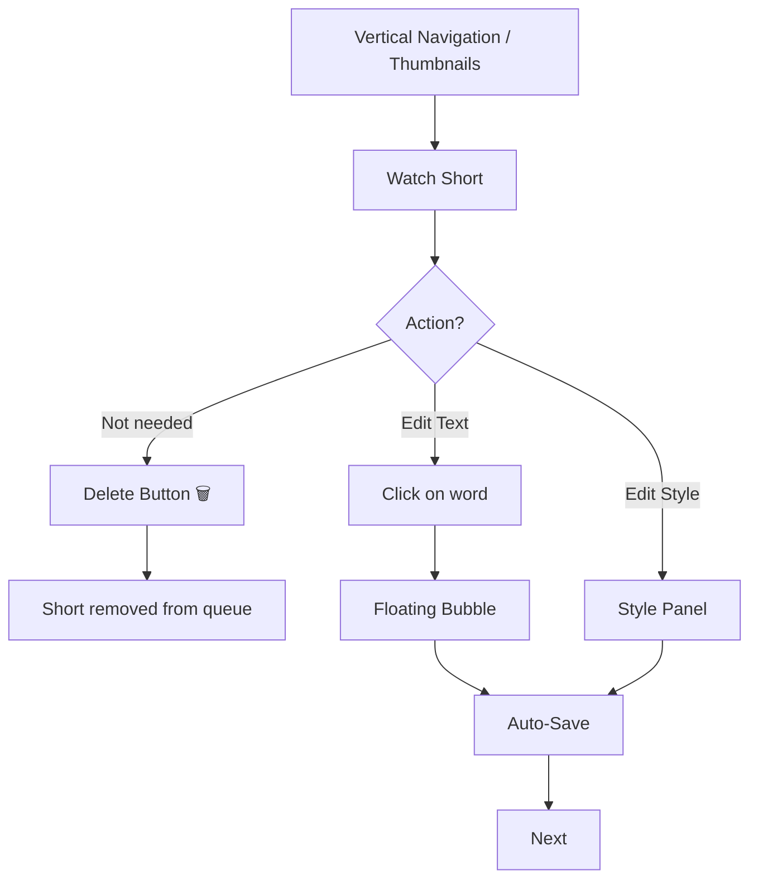
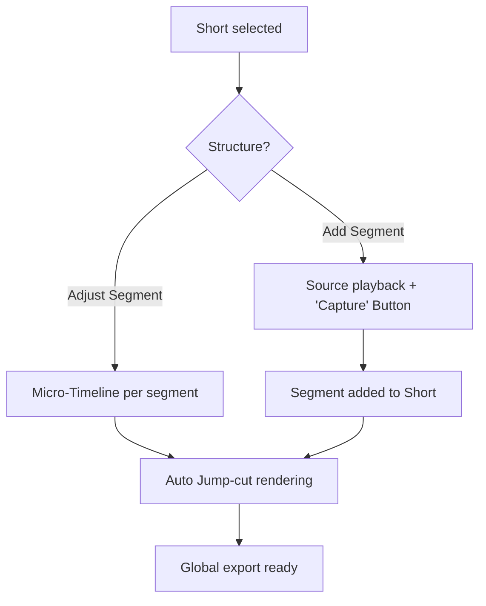

# UX Design Specification youtube-shorter-gemini

**Author:** jef
**Date:** 2026-02-10

---

## Executive Summary

### Project Vision
Enable a non-technical user to transform a long YouTube video into multiple high-quality vertical Shorts via an automated "local-first" process, with an interface focused on radical simplicity and direct text editing. Each Short can be composed of one or several non-contiguous segments for punchy editing.

### Target Users
Content creators and communicators looking to maximize their social media presence (TikTok, Reels, Shorts) without the learning curve of professional editing software.

---

## Project Understanding & Discovery

### Core Interaction Model: The Vertical Reel
The core experience adopts **Track A (Vertical Reel)**:
- **Navigation:** User scrolls vertically to pass from one Short to another.
- **List Management:** By default, all suggested Shorts are included in the export. The user only intervenes to **Delete** a Short they don't want.
- **Subtitle Editing:** Direct click on the text in the video.

---

## Core User Experience

### Defining Experience: The Creative Supervisor
The user validates the AI's work by "exception":
- **Thumbnail Navigation:** To skip quickly.
- **Zero Classic Timeline:** Replaced by **Segments** management within the same Short via a "Capture & Adjustment" model.

---

## Core Interaction Mechanics (V1)

### 2.1 Mechanics: Fine-Tuning the Magic
- **Dynamic Recropping (Drag-to-Crop):** Smooth recentering by dragging.
- **Capture Model:** A segment is captured by clicking a "Keep this moment" button or via keyboard shortcuts. The timeline is only used for adjustment.
- **Contextual Text Editing (Floating Interaction):** Floating editing bubble above the text.

---

## User Journey Flows

### 2. "Supervisor" Journey (Review & Fast Editing)
The user reviews the suggestions. If they don't like a suggestion, they delete it. If they like it, they move to the next one or refine it.

### 3. "Perfectionist" Journey (Multi-Segment)
For Shorts requiring combining several moments from the source video via the "Capture" mode.

---

## Component Strategy

### Custom Components (Lit)

#### 1. Reel Scroller
- **Loop:** No.
- **Loading:** Full preloading by default.

#### 2. Short Previewer
Handles video rendering including visual concatenation of segments (jump-cuts) and synchronized subtitles across the whole set.

#### 3. Precision Multi-Timeline (Zoomable)
Displays the source video ribbon. Focuses on captured segments.
- **Intelligent Refinement:** Start/end handles snap to **word boundaries** detected by transcription to avoid abrupt audio cuts.

---

## UX Consistency Patterns

### 1. Actions Hierarchy
- **Delete Action (Red/Discreet):** Delete a Short from the session.
- **Edit Action (Contextual):** Appears on hover or click (Indigo borders, bubbles).
- **Export Action (Primary - Indigo):** Global button "Export x Shorts" always visible.

### 2. Adjustment Feedback
Any change (Crop, Text, Trim) is **saved instantly** (Auto-save).

---

## Responsive Design & Accessibility

### 1. Responsive Strategy (Desktop-first)
The application is optimized for use on a computer (local processing power required).
- **Studio Layout**: Use persistent side panels for thumbnails and styles.
- **Adaptive Sidebars**: Switch to drawers (`sl-drawer`) on resolutions < 1200px.
- **Tactile** : Non prioritaire.

### 2. Accessibility Strategy (Pro Keyboard Shortcuts)
Integration of video editing software standards (Premiere, Resolve):
- **Playback**: `Space` (Play/Pause), `K` (Pause).
- **Fine Navigation**: `J` (Reverse/Slow), `L` (Forward/Speed up), `Arrows` (Frame by frame).
- **Editing**: `I` (Mark In / Segment start), `O` (Mark Out / Segment end).
- **Management**: `Del/Backspace` (Delete selected Short).
- **Inclusion**: WCAG 2.1 AA contrast index for the interface and mandatory drop shadows on dynamic subtitles.

### 3. Testing Strategy
- Automated tests via **Axe-core**.
- Manual validation of keyboard shortcut fluidity ("No-Mouse workflow").
