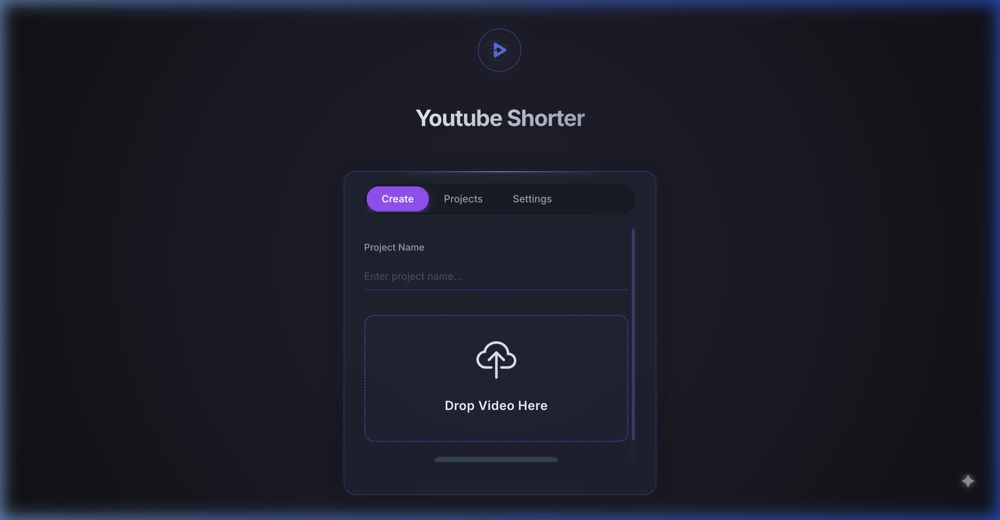
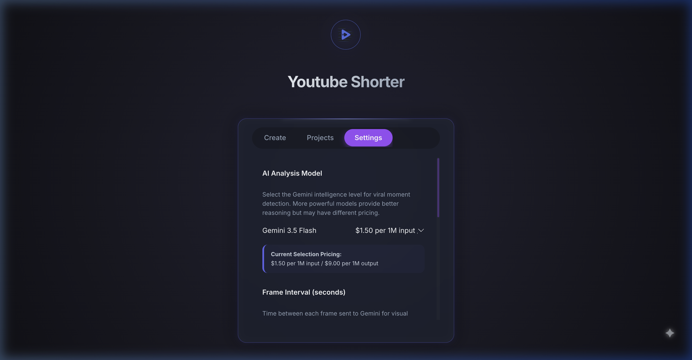
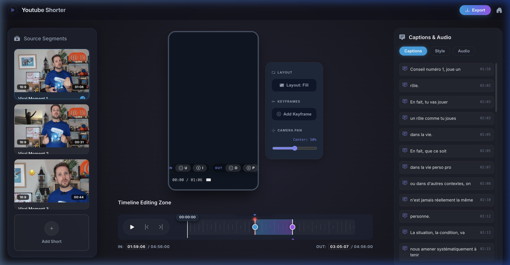
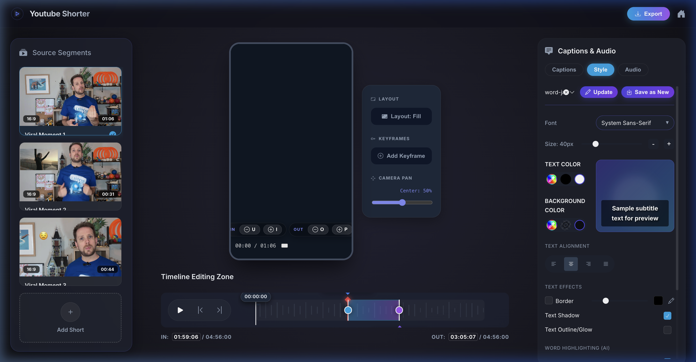
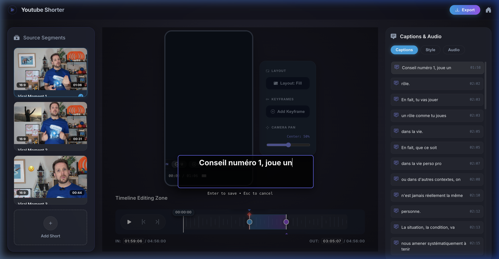
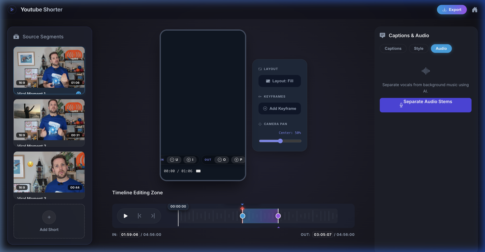

# YouTube Shorter Gemini - User Guide

Welcome to the **YouTube Shorter Gemini** User Guide. This guide will walk you through importing videos, configuring settings, and using the editor to create high-quality vertical Shorts.

---

## Table of Contents
1. [Home (Dashboard)](#1-home-dashboard)
2. [Configuration (Settings)](#2-configuration-settings)
3. [Edition Page](#3-edition-page)
   - [Subtitle Styling](#subtitle-styling)
   - [Subtitle Editing](#subtitle-editing)
   - [Audio Track & Stems Selection](#audio-track--stems-selection)
   - [Bounds & Timeline Markers](#bounds--timeline-markers)
   - [Custom Cover Image & Thumbnail Editor](#custom-cover-image--thumbnail-editor)
   - [Export Framing & Cover Options](#export-framing--cover-options)

---

## 1. Home (Dashboard)

The **Dashboard** is your central hub. Here, you can start a new video processing project or access previously created ones.

### Key Features:
- **Upload File / Enter URL**: Paste a YouTube video URL or upload a local video file (MP4/WebM) to start.
- **Project Name**: Give your project a clear, recognizable name.
- **Advanced Options**: Define constraints like minimum and maximum duration for the generated clips, or provide custom AI prompts to guide the highlight extraction.
- **Projects List**: View, reopen, or delete existing projects.

---

## 2. Configuration (Settings)

Access the **Settings** panel by clicking the **Settings** tab in the header. Here, you define the core AI and timing settings.

### Configuration Options:
- **Gemini API Key**: Your credentials for using Google Gemini AI models.
- **Gemini Model**: Select the model for analysis (e.g., `gemini-2.5-flash`).
- **Frame Interval (seconds)**: Set how often the video frames are sampled for visual AI analysis.
- **Default Prompts**: Customize the instructions sent to Gemini for discovering highlight moments.
- **Clips Durations**: Specify the default minimum and maximum lengths for extracted vertical shorts.

---

## 3. Edition Page

Once a video is processed, you are redirected to the **Editor Page**. Here you can preview and fine-tune your vertical reels.

The editor page includes a video preview on the left showing a real-time representation of the vertical crop, and editing tabs on the right.

### Subtitle Styling
Manage how captions look on your vertical video using the **Style** tab.

- **Font Family**: Pick a modern font for your text overlays.
- **Font Size & Color**: Adjust legibility and style.
- **Stroke (Outline)**: Choose outline colors and thickness to make subtitles pop on any background.
- **Position (Alignments & Margins)**: Align text to the top, center, or bottom of the vertical crop.
- **Presets**: Save your custom styles as templates to reuse them on other clips.

### Subtitle Editing
Edit transcription text and timings using the **Captions** tab.

- **Interactive Timestamps**: Click any subtitle block to jump directly to that timestamp in the video player.
- **Text Correction**: Double-click or select a segment to modify the text directly.
- **Timing Shifts**: Adjust the start and end times of specific captions.

### Audio Track & Stems Selection
Use the **Audio** tab to separate and balance audio streams.

- **Vocal & Accompaniment Separation**: Split the speaker's voice from background music.
- **Volume Sliders**: Independently adjust the volume of the vocals or background tracks.
- **Background Music**: Select and blend an external soundtrack if desired.

### Bounds & Timeline Markers
Adjust the vertical framing and clip length directly on the interactive timeline.

- **Interactive Handles**: Drag the green **IN** marker and red **OUT** marker on the player timeline to trim the short's duration.
- **Crop Adjustments**: Shift the focus area horizontally to keep the subject centered in the `9:16` vertical frame.

### Custom Cover Image & Thumbnail Editor
Make your Shorts stand out in YouTube feeds by assigning a custom portrait cover image (`9:16`) to every clip.

- **Portrait Segment Cards**: All clip cards in the left sidebar are displayed in vertical `9:16` format. Hover over any card and click the **pen icon** (`pencil`) located above the thumbnail to launch the **Thumbnail Editor**.
- **Upload & Drag-and-Drop**: Upload any image (PNG or JPEG, up to 5 MB) directly by dragging it into the drop zone or clicking to browse your files.
- **Precision 9:16 Crop Area**: The editor features a locked `9:16` vertical ratio canvas (`225×400px` display preview corresponding to a `1080×1920` final export).
- **Pan & Zoom Controls**: 
  - **Pan**: Click and drag inside the crop canvas to reposition your image.
  - **Zoom**: Use your mouse scroll wheel inside the canvas or click the `+` / `-` zoom controls at the bottom of the crop area.
  - **Reset**: Click the `Reset` button to quickly center and reset your image scale.
- **Live Preview**: Inspect how your final vertical cover looks in real time inside the side-by-side **Preview** panel (`117×208px`).
- **Save / Remove Cover**: Click **Save Cover** to upload and attach the cropped `1080×1920` cover to the Short, or click **Remove** (`trash` icon) to revert to the default video frame.

### Export Framing & Cover Options
When exporting your Short, any custom cover image you saved will automatically be embedded into the export pipeline:

- **First Frame Inclusion (`Frame 0`)**: During FFmpeg video rendering, your custom cover image is prepended as the very first frame (`0.0s`) of the generated vertical MP4 file. This ensures YouTube automatically picks it up as the default feed thumbnail while keeping subtitle and video timings perfectly aligned.
- **Cover Persistence**: Covers are safely stored locally in `uploads/covers/` and automatically cleaned up whenever the Short or project is deleted.
